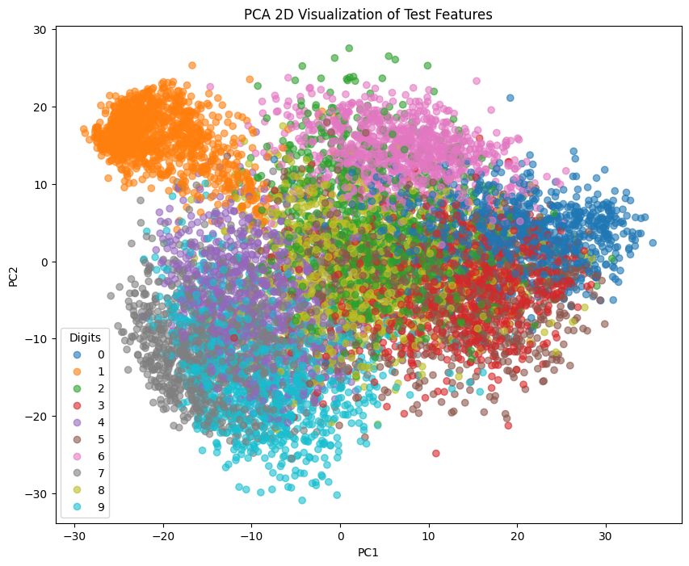

## Introduction

In this report, we discuss a Convolutional Neural Network trained on the MNIST dataset with the goal of identifying hand written digits.

## Layers & Performance Summary

The model has six (6) layers:

| Layer             | Parameters |
|:------------------|-----------:|
| `conv2d_2`        |         80 |
| `max_pooling2d_2` |          0 |
| `conv2d_3`        |      1,168 |
| `max_pooling2d_3` |          0 |
| `flatten_1`       |          0 |
| `dense_1`         |      7,850 |

## Extracting Feature Vectors

## Representation of Primary Features Via PCA

## Knn Report

After performing the PCA again, but with 10 components, KNN was used with $k = 5$. The model reported a test accuracy of 96.47%.

## Conclusion
