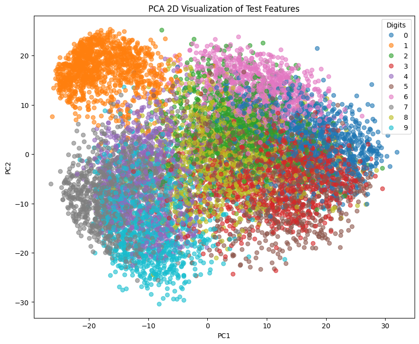

## Introduction

In this report, we discuss a Convolutional Neural Network trained on the MNIST dataset with the goal of identifying hand written digits.

## Layers & Performance Summary

The model has six (6) layers:

\renewcommand\tcap{Layer parameter counts}

| Layer             | Parameters |
|:------------------|-----------:|
| `conv2d_2`        |         80 |
| `max_pooling2d_2` |          0 |
| `conv2d_3`        |      1,168 |
| `max_pooling2d_3` |          0 |
| `flatten_1`       |          0 |
| `dense_1`         |      7,850 |

The CNN demonstrated a training accuracy of **99.92%**, and a test accuracy of **98.67%**, with epochs set to 100. The confusion matrix is displayed in Figure 1.

## Extracting Feature Vectors & Applying kNN

Feature vectors of the dataset were extracted from the Flattened layer, and kNN using Euclidean distance and $k = 5$. The kNN model displayed a test accuracy of **98.63%**.

The size of the final extracted feature vector was **940**.

## Representation of Primary Features Via PCA

PCA was applied to the entire test dataset, flattening it to a single vector. Then mapped to a single 2-dimensional vector of the principle features, and plotted in the scatterplot bellow. Each unique class is shown using a distinct colour.

## PCA + kNN Report

After performing the PCA again, but extracting 10 components, kNN was used with $k = 5$ and Euclidean distance. The model reported a test accuracy of 96.47%.

## Conclusion

In conclusion, the CNN classifier demonstrated an accuracy of 98.67% on the test set, with low mis-classification rates. Extracted features from the CNN model performed significantly better than features extracted from PCA.
